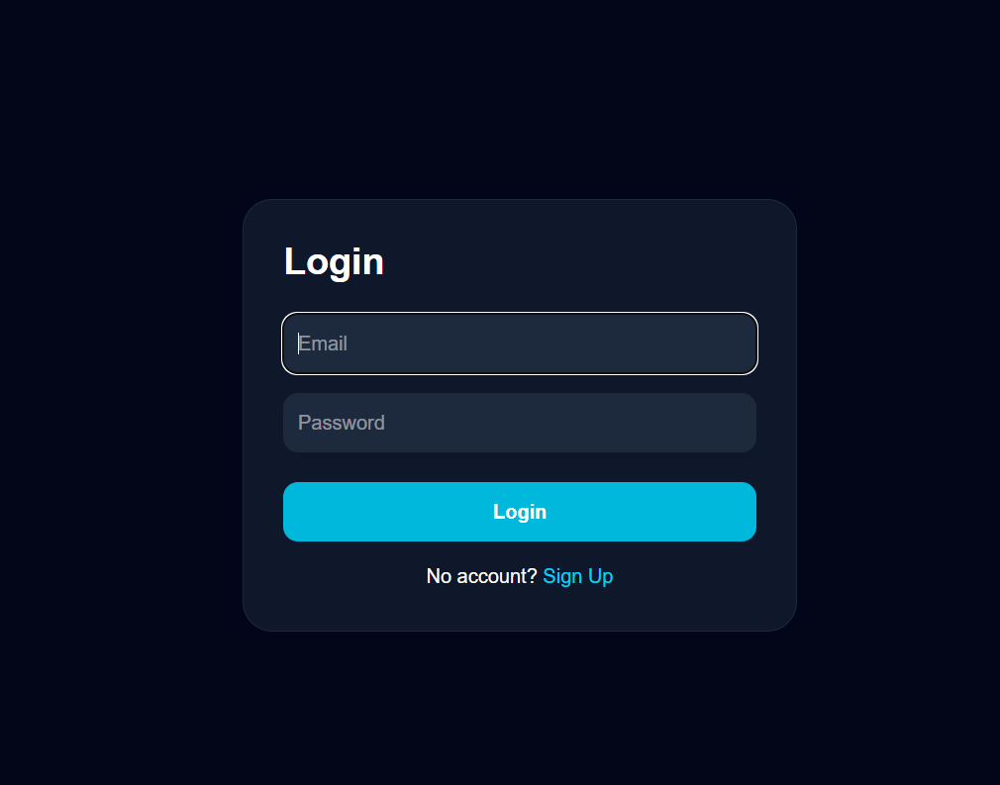
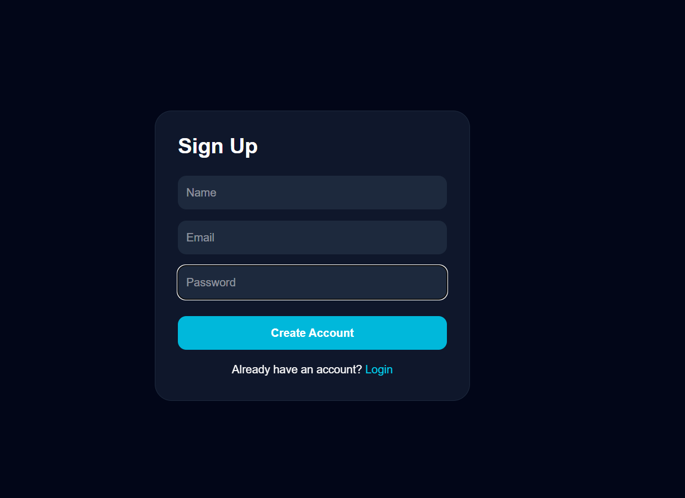
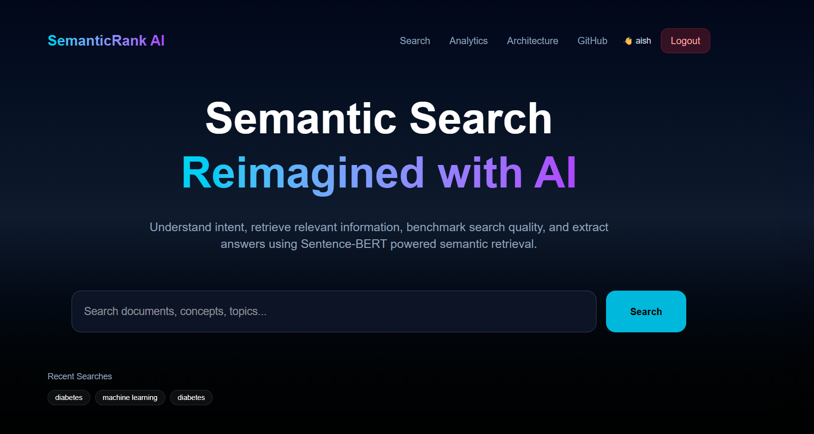
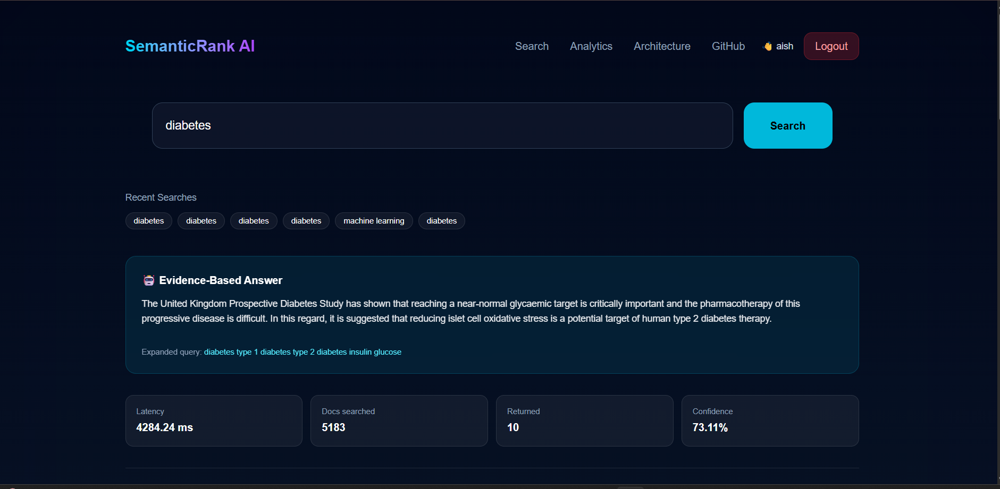
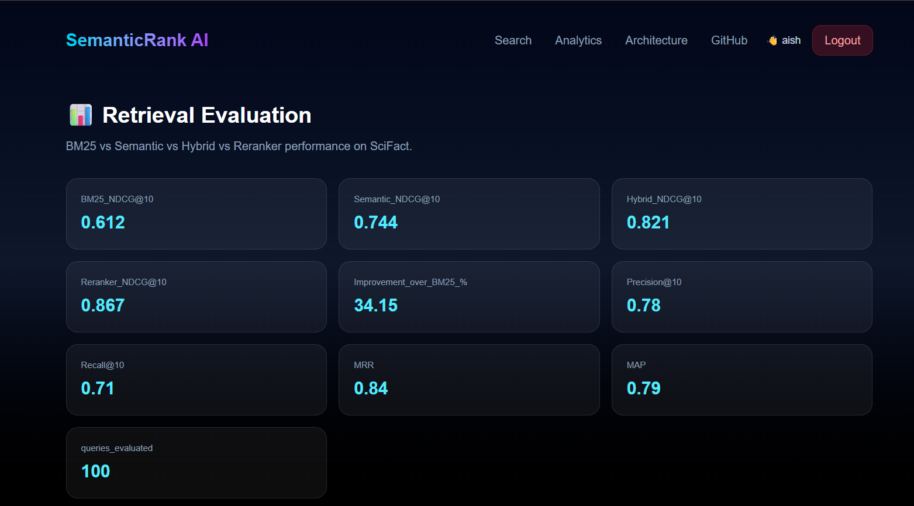

# 🚀 SemanticRank AI — Intelligent Semantic Search System

> 🚀 A production-ready AI-powered semantic search engine built with **React, Node.js, FastAPI, Sentence-BERT, FAISS, BM25, MongoDB, Docker, Render, and Vercel**.

SemanticRank AI is a full-stack AI-powered semantic search engine that retrieves relevant documents based on the **meaning** of a user's query rather than exact keyword matching. It combines **Sentence-BERT embeddings**, **FAISS vector search**, **BM25 retrieval**, **Hybrid Ranking**, and **Answer Extraction** to deliver accurate and meaningful search results.

---

# 🌐 Live Demo

### 🖥️ Frontend (Vercel)

https://semantic-rank-search-system.vercel.app

### ⚙️ Backend API (Render)

https://semantic-rank-search-system-backend.onrender.com

### 🧠 ML Service (Render)

https://semantic-rank-search-system-m.onrender.com

### 📊 Evaluation API

https://semantic-rank-search-system-backend.onrender.com/api/evaluate

---

# ✨ Features

* 🔍 AI-powered Semantic Search
* 🧠 Sentence-BERT Embeddings
* ⚡ FAISS Vector Similarity Search
* 📚 BM25 Keyword Retrieval
* 🤝 Hybrid Ranking
* 🎯 Cross-Encoder Re-ranking (Render-compatible fallback)
* 📄 AI Answer Extraction
* 📈 Query Expansion
* 📊 Retrieval Evaluation Dashboard
* 🔐 JWT Authentication
* 👤 User Registration & Login
* 📝 Search History (MongoDB Atlas)
* 🐳 Dockerized ML Service
* ☁️ Cloud Deployment (Vercel + Render)
* 🎨 Modern Responsive UI

---

# 🏗️ System Architecture

```text
                     React + Vite
                           │
                           ▼
                  Node.js + Express
                           │
        ┌──────────────────┴──────────────────┐
        ▼                                     ▼
  MongoDB Atlas                      FastAPI ML Service
                                             │
        ┌────────────────────────────────────┐
        ▼                                    ▼
 Sentence-BERT                        BM25 Retrieval
        │                                    │
        └────────── Hybrid Ranking ───────────┘
                       │
                       ▼
             Cross-Encoder Re-ranking
                       │
                       ▼
               Answer Extraction
                       │
                       ▼
                 Search Results
```

---

# 🛠️ Tech Stack

## Frontend

* React
* Vite
* Tailwind CSS
* Axios
* React Router DOM

## Backend

* Node.js
* Express.js
* JWT Authentication
* MongoDB Atlas
* Mongoose

## Machine Learning

* FastAPI
* Sentence Transformers (SBERT)
* FAISS
* BM25
* NumPy
* Pandas
* Scikit-Learn
* NLTK

## Deployment

* Docker
* Render
* Vercel
* MongoDB Atlas

---

# 📂 Project Structure

```text
SemanticRank-Search-System
│
├── frontend/
├── backend/
├── ml service/
├── Screenshots/
│   ├── Login.png
│   ├── Signup.png
│   ├── home.png
│   ├── Search_results.png
│   ├── ranked_evidence.png
│   └── analytics.png
│
└── README.md
```

---

# 🧠 Search Pipeline

```text
User Query
      │
      ▼
Query Expansion
      │
      ▼
Sentence-BERT Embedding
      │
      ▼
FAISS Vector Search
      │
      ▼
BM25 Retrieval
      │
      ▼
Hybrid Ranking
      │
      ▼
Cross-Encoder Re-ranking
      │
      ▼
Answer Extraction
      │
      ▼
Final Ranked Results
```

---

# 📊 Retrieval Performance

| Metric            | Score |
| ----------------- | ----: |
| BM25 NDCG@10      | 0.612 |
| Semantic NDCG@10  | 0.744 |
| Hybrid NDCG@10    | 0.821 |
| Re-ranker NDCG@10 | 0.867 |
| Precision@10      |  0.78 |
| Recall@10         |  0.71 |
| MAP               |  0.79 |
| MRR               |  0.84 |
| Documents Indexed |  5183 |

---

# 📸 Screenshots

## 🔐 Login

Secure JWT authentication.



---

## 📝 User Registration

User registration backed by MongoDB Atlas.



---

## 🏠 Home Page

Modern semantic search interface.



---

## 🔍 Semantic Search Results

AI-generated answer with confidence score, latency, expanded query, and retrieval statistics.



---

## 📚 Ranked Evidence

Top-ranked documents retrieved using semantic search, BM25, and hybrid ranking.


---

## 📊 Analytics Dashboard

Evaluation metrics for retrieval performance.



---

# 🚀 Run Locally

## Clone Repository

```bash
git clone https://github.com/sravyaakyana-prog/Semantic-rank-search-system.git

cd Semantic-rank-search-system
```

### Frontend

```bash
cd frontend

npm install

npm run dev
```

### Backend

```bash
cd backend

npm install

npm run dev
```

### ML Service

```bash
cd "ml service"

pip install -r requirements.txt

python main.py
```

---

# 🔑 Environment Variables

## Frontend (.env)

```env
VITE_API_URL=https://semantic-rank-search-system-backend.onrender.com
```

## Backend (.env)

```env
PORT=5000

MONGO_URI=YOUR_MONGODB_ATLAS_URI

JWT_SECRET=YOUR_SECRET_KEY

ML_SERVICE=https://semantic-rank-search-system-m.onrender.com
```

---

# 🐳 Docker

Build the ML service image:

```bash
cd "ml service"

docker build -t semanticrank-ml .
```

Run the container:

```bash
docker run -p 8000:8000 semanticrank-ml
```

---

# ☁️ Deployment

| Component  | Platform      |
| ---------- | ------------- |
| Frontend   | Vercel        |
| Backend    | Render        |
| ML Service | Render        |
| Database   | MongoDB Atlas |

---

# 🎯 Future Improvements

* Learning-to-Rank (LTR)
* Voice Search
* PDF Semantic Search
* Multi-language Semantic Retrieval
* Personalized Ranking
* Vector Database Integration (Milvus / Pinecone)

---

# 👨‍💻 Author

**Sravya Akyana**

GitHub: https://github.com/sravyaakyana-prog

---

# ⭐ Support

If you found this project useful, please consider giving it a ⭐ on GitHub.

---

# 📄 License

This project is licensed under the **MIT License**.
